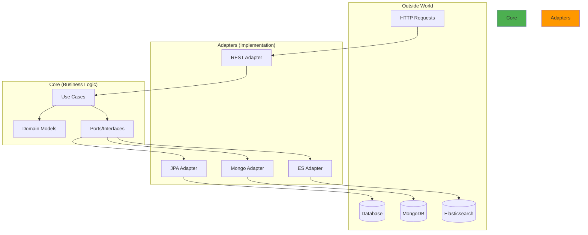
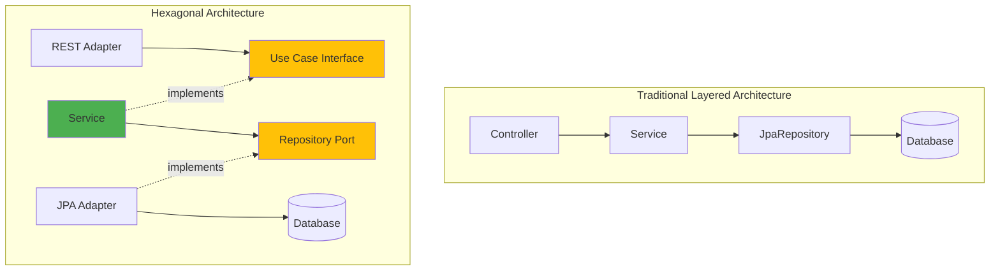

The **hexagonal architecture** (also called ports and adapters pattern) is a design approach that isolates business logic from external concerns like databases, APIs, and frameworks.

## The Hexagon Concept

Visualize your application as a hexagon where:

- **Center (Core):** Pure business logic
- **Ports:** Interface contracts for external communication
- **Adapters:** Implementations that connect to real infrastructure



## Why Hexagonal Architecture?

<AccordionGroup>
  <Accordion title="Independence from Frameworks">
    Your business logic doesn't depend on Spring, Hibernate, or any framework:
    
    ```java ProductService.java (Core)
    // NO Spring annotations!
    @RequiredArgsConstructor
    public class ProductService implements RegisterProductUseCase {
        private final ProductCommandRepository commandRepo;
        
        @Override
        public Product register(Product product) {
            return commandRepo.save(product);
        }
    }
    ```
    
    This service works with **any** dependency injection container (or even manual wiring).
  </Accordion>
  
  <Accordion title="Database Technology Agnostic">
    Swap databases without changing business logic:
    
    ```bash
    # Use JPA
    APP_PERSISTENCE_TYPE=jpa ./gradlew :app-main:bootRun
    
    # Use MongoDB
    APP_PERSISTENCE_TYPE=mongo ./gradlew :app-main:bootRun
    
    # Use Elasticsearch
    APP_PERSISTENCE_TYPE=elasticsearch ./gradlew :app-main:bootRun
    ```
    
    The **same use cases** work with all adapters because they depend on **interfaces**, not implementations.
  </Accordion>
  
  <Accordion title="Highly Testable">
    Test business logic with simple mocks:
    
    ```java ProductServiceTest.java
    @ExtendWith(MockitoExtension.class)
    class ProductServiceTest {
        @Mock
        private ProductCommandRepository commandRepository;
        
        @InjectMocks
        private ProductService productService;
        
        @Test
        void registerDelegatesToCommandRepository() {
            Product product = Product.builder().name("Keyboard").build();
            when(commandRepository.save(product)).thenReturn(product);
            
            Product result = productService.register(product);
            
            assertEquals(product, result);
        }
    }
    ```
    
    No Spring context, no database - just plain Java testing.
  </Accordion>
  
  <Accordion title="Clear Separation of Concerns">
    Each module has a single responsibility:
    
    - **core:** Business rules and domain logic
    - **data:** Persistence strategies
    - **web:** HTTP/REST concerns
    - **app-main:** Application startup and configuration
  </Accordion>
</AccordionGroup>

## Ports: The Interface Contracts

Ports are **interfaces** defined in the core module that specify what the business logic needs:

### Driving Ports (Use Cases)

**Driving ports** are use cases that external systems (like REST APIs) invoke:

```java RegisterProductUseCase.java
package com.fbaron.ims.product.usecase;

public interface RegisterProductUseCase {
    Product register(Product product);
}
```

```java GetProductUseCase.java
package com.fbaron.ims.product.usecase;

public interface GetProductUseCase {
    List<Product> getAll();
    Product getById(UUID id);
}
```

<Info>
  **Implementation:** The `ProductService` class implements both interfaces, providing the actual business logic.
</Info>

### Driven Ports (Repositories)

**Driven ports** are repository interfaces that the business logic calls to access infrastructure:

<Tabs>
  <Tab title="Command Repository">
    For **write operations** (Create, Update, Delete):
    
    ```java ProductCommandRepository.java
    package com.fbaron.ims.product.repository;
    
    /**
     * Specialized Port for creating, updating, and deleting data operations.
     */
    public interface ProductCommandRepository {
        Product save(Product product);
    }
    ```
  </Tab>
  
  <Tab title="Query Repository">
    For **read operations**:
    
    ```java ProductQueryRepository.java
    package com.fbaron.ims.product.repository;
    
    /**
     * Specialized Port for read-only operations.
     */
    public interface ProductQueryRepository {
        List<Product> findAll();
        Optional<Product> findById(UUID id);
    }
    ```
  </Tab>
</Tabs>

<Note>
  This **CQRS-inspired separation** allows different implementations for reads vs writes, enabling optimizations like read replicas or caching.
</Note>

## Adapters: The Implementations

Adapters are **implementations** that connect ports to real infrastructure:

### Driving Adapters (REST Controllers)

Driving adapters receive requests from the outside world:

```java ProductRestAdapter.java
@RestController
@RequiredArgsConstructor
@RequestMapping("/api/v1/products")
public class ProductRestAdapter {

    private final GetProductUseCase getProductUseCase;
    private final RegisterProductUseCase registerProductUseCase;
    private final ProductDtoMapper productDtoMapper;

    @PostMapping
    public ResponseEntity<ProductDto> registerProduct(
            @Valid @RequestBody RegisterProductDto dto) {
        var product = productDtoMapper.toModel(dto);
        var registeredProduct = registerProductUseCase.register(product);
        return ResponseEntity.status(HttpStatus.CREATED)
                .body(productDtoMapper.toDto(registeredProduct));
    }

    @GetMapping
    public ResponseEntity<List<ProductDto>> getAll() {
        var products = getProductUseCase.getAll();
        return ResponseEntity.ok(productDtoMapper.toDto(products));
    }
}
```

<Info>
  The controller depends on **use case interfaces**, not concrete service implementations. This is dependency inversion in action.
</Info>

### Driven Adapters (Persistence)

Driven adapters implement repository ports:

<Tabs>
  <Tab title="JPA Adapter">
    ```java InventoryMovementJpaAdapter.java
    @Component
    @ConditionalOnProperty(name = "app.persistence.type", havingValue = "jpa", matchIfMissing = true)
    @RequiredArgsConstructor
    public class InventoryMovementJpaAdapter implements
            InventoryMovementQueryRepository,
            InventoryMovementCommandRepository {
    
        private final InventoryMovementJpaRepository jpaRepository;
        private final InventoryMovementJpaMapper jpaMapper;
    
        @Override
        public InventoryMovement save(InventoryMovement inventoryMovement) {
            var jpaEntity = jpaMapper.toJpaEntity(inventoryMovement);
            return jpaMapper.toModel(jpaRepository.save(jpaEntity));
        }
    
        @Override
        public Integer findTotalInputs(UUID productId) {
            return jpaRepository.findTotalInputs(productId);
        }
    
        @Override
        public Integer findTotalOutputs(UUID productId) {
            return jpaRepository.findTotalOutPuts(productId);
        }
    }
    ```
  </Tab>
  
  <Tab title="JDBC Adapter">
    ```java InventoryMovementJdbcAdapter.java
    @Component
    @ConditionalOnProperty(name = "app.persistence.type", havingValue = "jdbc")
    @RequiredArgsConstructor
    public class InventoryMovementJdbcAdapter implements
            InventoryMovementQueryRepository,
            InventoryMovementCommandRepository {
    
        private final InventoryMovementJdbcRepository jdbcRepository;
        private final InventoryMovementJdbcMapper jdbcMapper;
    
        @Override
        public InventoryMovement save(InventoryMovement inventoryMovement) {
            var jdbcEntity = jdbcMapper.toJdbcEntity(inventoryMovement);
            var savedJdbcEntity = jdbcRepository.save(jdbcEntity);
            return jdbcMapper.toModel(savedJdbcEntity, inventoryMovement.getProduct());
        }
    
        @Override
        public Integer findTotalInputs(UUID productId) {
            return jdbcRepository.findTotalInputs(productId);
        }
    }
    ```
  </Tab>
  
  <Tab title="MongoDB Adapter">
    ```java InventoryMovementMongoAdapter.java
    @Component
    @ConditionalOnProperty(name = "app.persistence.type", havingValue = "mongo")
    @RequiredArgsConstructor
    public class InventoryMovementMongoAdapter implements
            InventoryMovementQueryRepository,
            InventoryMovementCommandRepository {
    
        private final InventoryMovementMongoRepository mongoRepository;
        private final InventoryMovementMongoMapper mongoMapper;
    
        @Override
        public InventoryMovement save(InventoryMovement inventoryMovement) {
            var mongoEntity = mongoMapper.toMongoEntity(inventoryMovement);
            var savedMongoEntity = mongoRepository.save(mongoEntity);
            return mongoMapper.toModel(savedMongoEntity, inventoryMovement.getProduct());
        }
    }
    ```
  </Tab>
  
  <Tab title="Elasticsearch Adapter">
    ```java InventoryMovementElasticsearchAdapter.java
    @Component
    @ConditionalOnProperty(name = "app.persistence.type", havingValue = "elasticsearch")
    @RequiredArgsConstructor
    public class InventoryMovementElasticsearchAdapter implements
            InventoryMovementQueryRepository,
            InventoryMovementCommandRepository {
    
        private final InventoryMovementElasticsearchRepository repository;
        private final InventoryMovementElasticsearchMapper mapper;
    
        @Override
        public InventoryMovement save(InventoryMovement inventoryMovement) {
            var entity = mapper.toEntity(inventoryMovement);
            var savedEntity = repository.save(entity);
            return mapper.toModel(savedEntity, inventoryMovement.getProduct());
        }
    }
    ```
  </Tab>
</Tabs>

<Warning>
  All adapters implement the **same interfaces**. Only one is activated at runtime via `@ConditionalOnProperty`.
</Warning>

## Dependency Inversion Principle

The key to hexagonal architecture is **dependency inversion**:



**Traditional approach:** High-level modules depend on low-level modules (database)

**Hexagonal approach:** Both high-level and low-level modules depend on abstractions (ports)

## Wiring It Together

The `app-main` module configures services as Spring beans:

```java InventoryBeanConfig.java
@Configuration
public class InventoryBeanConfig {

    @Bean
    public ProductService productService(
            ProductQueryRepository queryRepository,
            ProductCommandRepository commandRepository) {
        return new ProductService(queryRepository, commandRepository);
    }

    @Bean
    public InventoryMovementService inventoryMovementService(
            ProductQueryRepository productQueryRepository,
            InventoryMovementCommandRepository commandRepository,
            InventoryMovementQueryRepository queryRepository) {
        return new InventoryMovementService(
            productQueryRepository, 
            commandRepository, 
            queryRepository
        );
    }
}
```

<Steps>
  <Step title="Spring scans for @Component adapters">
    Finds JPA, JDBC, MongoDB, and Elasticsearch adapters, but only activates one based on `app.persistence.type`.
  </Step>
  
  <Step title="Configuration creates service beans">
    Injects the active adapter into service constructors.
  </Step>
  
  <Step title="Controllers autowire use case interfaces">
    Spring provides the service bean that implements the interface.
  </Step>
</Steps>

## Benefits Recap

<CardGroup cols={2}>
  <Card title="Testability" icon="vial">
    Mock ports instead of complex infrastructure
  </Card>
  
  <Card title="Flexibility" icon="sliders">
    Swap adapters without touching business logic
  </Card>
  
  <Card title="Maintainability" icon="screwdriver-wrench">
    Changes in one layer don't affect others
  </Card>
  
  <Card title="Clarity" icon="lightbulb">
    Clear boundaries make code easy to understand
  </Card>
</CardGroup>

## Next Steps

<CardGroup cols={2}>
  <Card title="Module Structure" icon="folder-tree" href="/architecture/module-structure">
    See how files are organized in each module
  </Card>
  <Card title="Ports and Adapters" icon="plug" href="/architecture/ports-and-adapters">
    Detailed guide to all ports and their adapters
  </Card>
  <Card title="Persistence Adapters" icon="database" href="/guides/persistence-adapters">
    Learn about each persistence technology
  </Card>
  <Card title="Testing Strategies" icon="flask" href="/guides/testing-strategies">
    Write tests for hexagonal architecture
  </Card>
</CardGroup>
