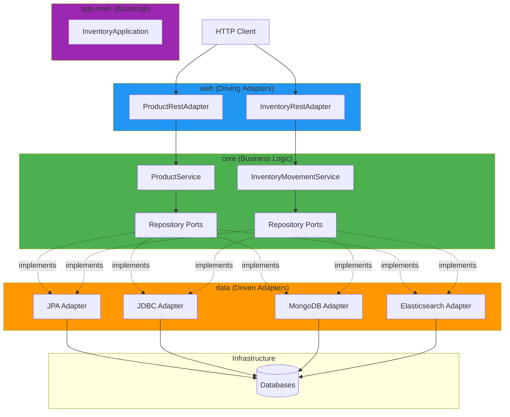

The Modular Hexagonal Inventory System implements a strict separation of concerns using hexagonal architecture (also known as ports and adapters pattern) combined with Gradle's multi-module system.

## The Four Modules

The application is divided into four independent Gradle modules, each with a specific responsibility:

<CardGroup cols={2}>
  <Card title="core" icon="brain" color="#4CAF50">
    Pure business logic with zero framework dependencies. Contains domain models, use cases, and port interfaces.
  </Card>
  
  <Card title="data" icon="database" color="#FF9800">
    Persistence adapters implementing repository ports. Supports JPA, JDBC, MongoDB, and Elasticsearch.
  </Card>
  
  <Card title="web" icon="globe" color="#2196F3">
    REST API adapters exposing use cases via HTTP endpoints. Contains controllers and DTOs.
  </Card>
  
  <Card title="app-main" icon="rocket" color="#9C27B0">
    Bootstrap module that wires everything together and runs the Spring Boot application.
  </Card>
</CardGroup>

## Architectural Diagram



## Dependency Flow

The modules follow a **strict dependency hierarchy** to maintain architectural boundaries:

<Steps>
  <Step title="core (Zero Dependencies)">
    The core module has **no external dependencies** except code generation tools (Lombok, MapStruct).
    
    ```groovy
    // core/build.gradle
    dependencies {
        // NO framework dependencies!
    }
    ```
    
    This ensures business logic remains **framework-agnostic** and **highly portable**.
  </Step>
  
  <Step title="data → core">
    The data module depends on core to implement repository ports:
    
    ```groovy
    // data/build.gradle
    dependencies {
        api project(':core')
        implementation 'org.springframework.boot:spring-boot-starter-data-jpa'
        // ... other persistence dependencies
    }
    ```
  </Step>
  
  <Step title="web → core">
    The web module depends on core to access use cases:
    
    ```groovy
    // web/build.gradle
    dependencies {
        implementation project(':core')
        implementation 'org.springframework.boot:spring-boot-starter-web'
    }
    ```
  </Step>
  
  <Step title="app-main → core + data + web">
    The bootstrap module brings everything together:
    
    ```groovy
    // app-main/build.gradle
    dependencies {
        implementation project(':core')
        implementation project(':data')
        implementation project(':web')
    }
    ```
  </Step>
</Steps>

<Warning>
  **Reverse dependencies are prohibited!** The core module must never depend on data or web modules. This is enforced at compile time by Gradle.
</Warning>

## Layer Responsibilities

<Tabs>
  <Tab title="Core (Business Logic)">
    The **core** module contains:
    
    ### Domain Models
    Pure Java objects representing business concepts:
    
    ```java Product.java
    package com.fbaron.ims.product.model;
    
    @Getter
    @Builder
    public class Product {
        private UUID id;
        private String name;
        private String description;
        private BigDecimal price;
        private String category;
    }
    ```
    
    ### Use Case Interfaces
    Define business operations:
    
    ```java RegisterProductUseCase.java
    public interface RegisterProductUseCase {
        Product register(Product product);
    }
    ```
    
    ### Repository Ports (Interfaces)
    Define data access contracts:
    
    ```java ProductCommandRepository.java
    public interface ProductCommandRepository {
        Product save(Product product);
    }
    ```
    
    ### Service Implementations
    Orchestrate business logic:
    
    ```java ProductService.java
    @RequiredArgsConstructor
    public class ProductService implements RegisterProductUseCase {
        private final ProductCommandRepository commandRepo;
        
        @Override
        public Product register(Product product) {
            return commandRepo.save(product);
        }
    }
    ```
    
    <Note>
      Services are **not** Spring components - they're plain Java classes instantiated via `@Bean` configuration.
    </Note>
  </Tab>
  
  <Tab title="Data (Persistence)">
    The **data** module implements repository ports using various technologies:
    
    ### JPA Adapter
    ```java InventoryMovementJpaAdapter.java
    @Component
    @ConditionalOnProperty(name = "app.persistence.type", havingValue = "jpa", matchIfMissing = true)
    @RequiredArgsConstructor
    public class InventoryMovementJpaAdapter implements
            InventoryMovementQueryRepository,
            InventoryMovementCommandRepository {
    
        private final InventoryMovementJpaRepository jpaRepository;
        private final InventoryMovementJpaMapper jpaMapper;
    
        @Override
        public InventoryMovement save(InventoryMovement inventoryMovement) {
            var jpaEntity = jpaMapper.toJpaEntity(inventoryMovement);
            return jpaMapper.toModel(jpaRepository.save(jpaEntity));
        }
    }
    ```
    
    ### JDBC Adapter
    ```java InventoryMovementJdbcAdapter.java
    @Component
    @ConditionalOnProperty(name = "app.persistence.type", havingValue = "jdbc")
    @RequiredArgsConstructor
    public class InventoryMovementJdbcAdapter implements
            InventoryMovementQueryRepository,
            InventoryMovementCommandRepository {
        // JDBC implementation
    }
    ```
    
    <Info>
      Only one adapter is active at runtime, controlled by `app.persistence.type` configuration.
    </Info>
  </Tab>
  
  <Tab title="Web (API)">
    The **web** module exposes REST endpoints:
    
    ```java ProductRestAdapter.java
    @RestController
    @RequiredArgsConstructor
    @RequestMapping("/api/v1/products")
    public class ProductRestAdapter {
    
        private final GetProductUseCase getProductUseCase;
        private final RegisterProductUseCase registerProductUseCase;
        private final ProductDtoMapper productDtoMapper;
    
        @PostMapping
        public ResponseEntity<ProductDto> registerProduct(
                @Valid @RequestBody RegisterProductDto dto) {
            var product = productDtoMapper.toModel(dto);
            var registeredProduct = registerProductUseCase.register(product);
            return ResponseEntity.status(HttpStatus.CREATED)
                    .body(productDtoMapper.toDto(registeredProduct));
        }
    }
    ```
    
    Controllers depend on **use case interfaces**, not concrete implementations.
  </Tab>
  
  <Tab title="app-main (Bootstrap)">
    The **app-main** module contains:
    
    ### Spring Boot Entry Point
    ```java InventoryApplication.java
    @SpringBootApplication
    @ComponentScan(basePackages = "com.fbaron.ims")
    public class InventoryApplication {
        public static void main(String[] args) {
            SpringApplication.run(InventoryApplication.class, args);
        }
    }
    ```
    
    ### Configuration Files
    - `application.yaml` - Base configuration
    - `application-develop.yaml` - Development profile
    - `application-release.yaml` - Release profile
    - `application-prod.yaml` - Production profile
  </Tab>
</Tabs>

## Key Architectural Principles

<AccordionGroup>
  <Accordion title="1. Dependency Inversion">
    Business logic (core) defines interfaces (ports). Infrastructure (data, web) implements them.
    
    ```mermaid
    graph LR
        Service[ProductService] --> Port[ProductCommandRepository]
        Adapter[JpaAdapter] -.implements.-> Port
        
        style Service fill:#4CAF50
        style Port fill:#FFC107
        style Adapter fill:#FF9800
    ```
    
    The dependency points **inward** toward the core, not outward to infrastructure.
  </Accordion>
  
  <Accordion title="2. Framework Agnostic Core">
    The core module uses only:
    - Standard Java (no Spring, no JPA annotations)
    - Lombok for boilerplate reduction
    - MapStruct for object mapping
    
    This makes the business logic:
    - **Testable** - No need to load Spring context
    - **Portable** - Can migrate to different frameworks
    - **Fast** - Compile and test quickly
  </Accordion>
  
  <Accordion title="3. CQRS-Inspired Repository Separation">
    Repositories are split into **command** (write) and **query** (read) interfaces:
    
    ```java
    // Write operations
    public interface ProductCommandRepository {
        Product save(Product product);
    }
    
    // Read operations
    public interface ProductQueryRepository {
        List<Product> findAll();
        Optional<Product> findById(UUID id);
    }
    ```
    
    This enables:
    - Different implementations for reads vs writes
    - Optimized query strategies
    - Clearer intent in service classes
  </Accordion>
  
  <Accordion title="4. Single Adapter Activation">
    Multiple adapters are compiled into the application, but only one is active at runtime:
    
    ```java
    @ConditionalOnProperty(name = "app.persistence.type", havingValue = "jpa")
    public class JpaAdapter { }
    
    @ConditionalOnProperty(name = "app.persistence.type", havingValue = "jdbc")
    public class JdbcAdapter { }
    ```
    
    Switch between them with a single environment variable:
    ```bash
    APP_PERSISTENCE_TYPE=mongo ./gradlew :app-main:bootRun
    ```
  </Accordion>
</AccordionGroup>

## Benefits of This Architecture

<CardGroup cols={2}>
  <Card title="Testability" icon="vial">
    Test business logic without databases or web servers using simple mocks.
  </Card>
  
  <Card title="Flexibility" icon="wand-magic-sparkles">
    Swap persistence or API technologies without touching business logic.
  </Card>
  
  <Card title="Maintainability" icon="wrench">
    Clear boundaries prevent coupling and make code easier to understand.
  </Card>
  
  <Card title="Portability" icon="truck">
    Framework-agnostic core can move to different platforms or languages.
  </Card>
</CardGroup>

## Next Steps

<CardGroup cols={2}>
  <Card title="Hexagonal Pattern" icon="hexagon" href="/architecture/hexagonal-pattern">
    Deep dive into ports and adapters
  </Card>
  <Card title="Module Structure" icon="folder-tree" href="/architecture/module-structure">
    Explore each module's internal organization
  </Card>
  <Card title="Ports and Adapters" icon="plug" href="/architecture/ports-and-adapters">
    Understand the interface contracts
  </Card>
  <Card title="Adding Features" icon="plus" href="/guides/adding-features">
    Learn how to extend the system
  </Card>
</CardGroup>
