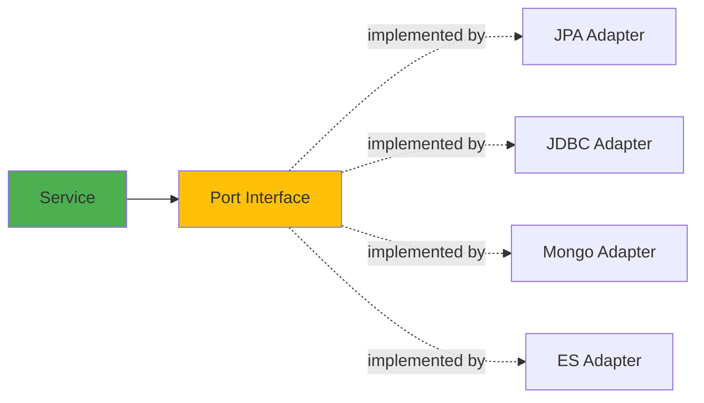

This guide documents all ports (interfaces) defined in the core module and their various adapter implementations.

## What Are Ports and Adapters?

<Info>
  **Ports** are interfaces that define contracts. **Adapters** are implementations that fulfill those contracts using specific technologies.
</Info>



## Driving Ports (Use Cases)

Driving ports represent **what the system can do**. External systems (like REST APIs) call these:

### Product Use Cases

<Tabs>
  <Tab title="RegisterProductUseCase">
    **Purpose:** Register a new product in the system
    
    ```java RegisterProductUseCase.java
    package com.fbaron.ims.product.usecase;
    
    public interface RegisterProductUseCase {
        Product register(Product product);
    }
    ```
    
    **Implementation:**
    ```java ProductService.java
    @RequiredArgsConstructor
    public class ProductService implements RegisterProductUseCase {
        private final ProductCommandRepository commandRepo;
        
        @Override
        public Product register(Product product) {
            return commandRepo.save(product);
        }
    }
    ```
    
    **Consumed By:**
    ```java ProductRestAdapter.java
    @RestController
    public class ProductRestAdapter {
        private final RegisterProductUseCase registerProductUseCase;
        
        @PostMapping
        public ResponseEntity<ProductDto> registerProduct(
                @Valid @RequestBody RegisterProductDto dto) {
            var product = mapper.toModel(dto);
            var result = registerProductUseCase.register(product);
            return ResponseEntity.status(CREATED).body(mapper.toDto(result));
        }
    }
    ```
  </Tab>
  
  <Tab title="GetProductUseCase">
    **Purpose:** Retrieve product information
    
    ```java GetProductUseCase.java
    package com.fbaron.ims.product.usecase;
    
    public interface GetProductUseCase {
        Product getById(UUID id);
        List<Product> getAll();
    }
    ```
    
    **Implementation:**
    ```java ProductService.java (excerpt)
    @Override
    public Product getById(UUID id) {
        return queryRepo.findById(id)
                .orElseThrow(() -> new ProductNotFoundException(id));
    }
    
    @Override
    public List<Product> getAll() {
        return queryRepo.findAll();
    }
    ```
    
    **Consumed By:**
    ```java ProductRestAdapter.java (excerpt)
    @GetMapping
    public ResponseEntity<List<ProductDto>> getAll() {
        var products = getProductUseCase.getAll();
        return ResponseEntity.ok(mapper.toDto(products));
    }
    
    @GetMapping("/{productId}")
    public ResponseEntity<ProductDto> getById(@PathVariable UUID productId) {
        var product = getProductUseCase.getById(productId);
        return ResponseEntity.ok(mapper.toDto(product));
    }
    ```
  </Tab>
</Tabs>

### Inventory Use Cases

<Tabs>
  <Tab title="RegisterMovementUseCase">
    **Purpose:** Record inventory movements (inbound/outbound)
    
    ```java RegisterMovementUseCase.java
    package com.fbaron.ims.inventory.usecase;
    
    public interface RegisterMovementUseCase {
        InventoryMovement inbound(UUID productId, Integer quantity, String reason);
        InventoryMovement outbound(UUID productId, Integer quantity, String reason);
    }
    ```
    
    **Implementation:**
    ```java InventoryMovementService.java (excerpt)
    @Override
    public InventoryMovement inbound(UUID productId, Integer quantity, String reason) {
        validateQuantity(quantity);
        
        Product product = productQuery.findById(productId)
                .orElseThrow(() -> new ProductNotFoundException(productId));
        
        InventoryMovement movement = InventoryMovement.builder()
                .product(product)
                .quantity(quantity)
                .type(MovementType.INBOUND)
                .reason(reason)
                .createdAt(LocalDateTime.now())
                .build();
        
        return movementCommand.save(movement);
    }
    
    @Override
    public InventoryMovement outbound(UUID productId, Integer quantity, String reason) {
        validateQuantity(quantity);
        
        Product product = productQuery.findById(productId)
                .orElseThrow(() -> new ProductNotFoundException(productId));
        
        Integer currentBalance = calculateStock(productId);
        if (currentBalance < quantity) {
            throw new InsufficientStockException(
                "Cannot exit " + quantity + " units. Current balance is only " + currentBalance
            );
        }
        
        // Create and save outbound movement...
    }
    ```
    
    <Note>
      The outbound method validates that sufficient stock exists before allowing the movement.
    </Note>
  </Tab>
  
  <Tab title="GetMovementUseCase">
    **Purpose:** Calculate stock balance for a product
    
    ```java GetMovementUseCase.java
    package com.fbaron.ims.inventory.usecase;
    
    public interface GetMovementUseCase {
        Integer calculateStock(UUID productId);
    }
    ```
    
    **Implementation:**
    ```java InventoryMovementService.java (excerpt)
    @Override
    public Integer calculateStock(UUID productId) {
        productQuery.findById(productId)
                .orElseThrow(() -> new ProductNotFoundException(productId));
        
        Integer inputs = movementQuery.findTotalInputs(productId);
        Integer outputs = movementQuery.findTotalOutputs(productId);
        
        return inputs - outputs;
    }
    ```
    
    **Consumed By:**
    ```java InventoryRestAdapter.java (excerpt)
    @GetMapping("/{productId}")
    public ResponseEntity<Integer> getStock(@PathVariable UUID productId) {
        return ResponseEntity.ok(getMovementUseCase.calculateStock(productId));
    }
    ```
  </Tab>
</Tabs>

## Driven Ports (Repositories)

Driven ports represent **what the system needs**. The business logic calls these to interact with infrastructure:

### Product Repository Ports

<Tabs>
  <Tab title="ProductCommandRepository">
    **Purpose:** Write operations for products
    
    ```java ProductCommandRepository.java
    package com.fbaron.ims.product.repository;
    
    /**
     * Specialized Port for creating, updating, and deleting data operations.
     */
    public interface ProductCommandRepository {
        Product save(Product product);
    }
    ```
    
    **Adapters:**
    
    <AccordionGroup>
      <Accordion title="JPA Adapter">
        ```java ProductJpaAdapter.java
        @Component
        @ConditionalOnProperty(name = "app.persistence.type", havingValue = "jpa", matchIfMissing = true)
        public class ProductJpaAdapter implements 
                ProductCommandRepository, 
                ProductQueryRepository {
            
            private final ProductJpaRepository jpaRepo;
            private final ProductJpaMapper mapper;
            
            @Override
            public Product save(Product product) {
                var entity = mapper.toJpaEntity(product);
                return mapper.toModel(jpaRepo.save(entity));
            }
        }
        ```
      </Accordion>
      
      <Accordion title="JDBC Adapter">
        ```java ProductJdbcAdapter.java
        @Component
        @ConditionalOnProperty(name = "app.persistence.type", havingValue = "jdbc")
        public class ProductJdbcAdapter implements 
                ProductCommandRepository, 
                ProductQueryRepository {
            
            private final ProductJdbcRepository jdbcRepo;
            private final ProductJdbcMapper mapper;
            
            @Override
            public Product save(Product product) {
                var entity = mapper.toJdbcEntity(product);
                return mapper.toModel(jdbcRepo.save(entity));
            }
        }
        ```
      </Accordion>
      
      <Accordion title="MongoDB Adapter">
        ```java ProductMongoAdapter.java
        @Component
        @ConditionalOnProperty(name = "app.persistence.type", havingValue = "mongo")
        public class ProductMongoAdapter implements 
                ProductCommandRepository, 
                ProductQueryRepository {
            
            private final ProductMongoRepository mongoRepo;
            private final ProductMongoMapper mapper;
            
            @Override
            public Product save(Product product) {
                var document = mapper.toMongoDocument(product);
                return mapper.toModel(mongoRepo.save(document));
            }
        }
        ```
      </Accordion>
    </AccordionGroup>
  </Tab>
  
  <Tab title="ProductQueryRepository">
    **Purpose:** Read operations for products
    
    ```java ProductQueryRepository.java
    package com.fbaron.ims.product.repository;
    
    /**
     * Specialized Port for read-only operations.
     */
    public interface ProductQueryRepository {
        List<Product> findAll();
        Optional<Product> findById(UUID id);
    }
    ```
    
    <Note>
      This interface is typically implemented by the same adapter classes that implement ProductCommandRepository.
    </Note>
  </Tab>
</Tabs>

### Inventory Repository Ports

<Tabs>
  <Tab title="InventoryMovementCommandRepository">
    **Purpose:** Write operations for inventory movements
    
    ```java InventoryMovementCommandRepository.java
    package com.fbaron.ims.inventory.repository;
    
    public interface InventoryMovementCommandRepository {
        InventoryMovement save(InventoryMovement inventoryMovement);
    }
    ```
    
    **Example Adapter:**
    ```java InventoryMovementJpaAdapter.java
    @Component
    @ConditionalOnProperty(name = "app.persistence.type", havingValue = "jpa", matchIfMissing = true)
    @RequiredArgsConstructor
    public class InventoryMovementJpaAdapter implements
            InventoryMovementQueryRepository,
            InventoryMovementCommandRepository {
    
        private final InventoryMovementJpaRepository jpaRepository;
        private final InventoryMovementJpaMapper jpaMapper;
    
        @Override
        public InventoryMovement save(InventoryMovement inventoryMovement) {
            var jpaEntity = jpaMapper.toJpaEntity(inventoryMovement);
            return jpaMapper.toModel(jpaRepository.save(jpaEntity));
        }
    }
    ```
  </Tab>
  
  <Tab title="InventoryMovementQueryRepository">
    **Purpose:** Read operations for inventory movements
    
    ```java InventoryMovementQueryRepository.java
    package com.fbaron.ims.inventory.repository;
    
    public interface InventoryMovementQueryRepository {
        Integer findTotalInputs(UUID productId);
        Integer findTotalOutputs(UUID productId);
    }
    ```
    
    **Example Implementation (JPA):**
    ```java InventoryMovementJpaAdapter.java (excerpt)
    @Override
    public Integer findTotalInputs(UUID productId) {
        return jpaRepository.findTotalInputs(productId);
    }
    
    @Override
    public Integer findTotalOutputs(UUID productId) {
        return jpaRepository.findTotalOutPuts(productId);
    }
    ```
    
    **Underlying Spring Data Repository:**
    ```java InventoryMovementJpaRepository.java
    public interface InventoryMovementJpaRepository 
            extends JpaRepository<InventoryMovementJpaEntity, UUID> {
        
        @Query("SELECT COALESCE(SUM(im.quantity), 0) " +
               "FROM InventoryMovementJpaEntity im " +
               "WHERE im.product.id = :productId AND im.type = 'INBOUND'")
        Integer findTotalInputs(@Param("productId") UUID productId);
        
        @Query("SELECT COALESCE(SUM(im.quantity), 0) " +
               "FROM InventoryMovementJpaEntity im " +
               "WHERE im.product.id = :productId AND im.type = 'OUTBOUND'")
        Integer findTotalOutPuts(@Param("productId") UUID productId);
    }
    ```
  </Tab>
</Tabs>

## Adapter Activation Strategy

Only one adapter per port is active at runtime, controlled by configuration:

<CodeGroup>
```java JPA (Default)
@Component
@ConditionalOnProperty(name = "app.persistence.type", havingValue = "jpa", matchIfMissing = true)
public class InventoryMovementJpaAdapter { }
```

```java JDBC
@Component
@ConditionalOnProperty(name = "app.persistence.type", havingValue = "jdbc")
public class InventoryMovementJdbcAdapter { }
```

```java MongoDB
@Component
@ConditionalOnProperty(name = "app.persistence.type", havingValue = "mongo")
public class InventoryMovementMongoAdapter { }
```

```java Elasticsearch
@Component
@ConditionalOnProperty(name = "app.persistence.type", havingValue = "elasticsearch")
public class InventoryMovementElasticsearchAdapter { }
```
</CodeGroup>

<Steps>
  <Step title="Set Environment Variable">
    ```bash
    export APP_PERSISTENCE_TYPE=mongo
    ```
  </Step>
  
  <Step title="Spring Evaluates @ConditionalOnProperty">
    Only the MongoDB adapter is registered as a Spring bean.
  </Step>
  
  <Step title="Service Bean is Configured">
    The `@Bean` configuration injects the MongoDB adapter:
    
    ```java InventoryBeanConfig.java
    @Bean
    public InventoryMovementService inventoryMovementService(
            ProductQueryRepository productQueryRepository,
            InventoryMovementCommandRepository commandRepo,  // MongoDB adapter injected here
            InventoryMovementQueryRepository queryRepo) {   // MongoDB adapter injected here
        return new InventoryMovementService(
            productQueryRepository, commandRepo, queryRepo
        );
    }
    ```
  </Step>
</Steps>

## Benefits of This Approach

<CardGroup cols={2}>
  <Card title="Testability" icon="vial">
    Mock the port interfaces instead of concrete implementations
  </Card>
  
  <Card title="Flexibility" icon="sliders">
    Switch persistence strategies with a configuration change
  </Card>
  
  <Card title="Independence" icon="shield">
    Business logic doesn't know or care which adapter is used
  </Card>
  
  <Card title="Maintainability" icon="wrench">
    Add new adapters without modifying existing code
  </Card>
</CardGroup>

## Port Design Principles

<AccordionGroup>
  <Accordion title="Single Responsibility">
    Each port has one clear purpose:
    - `RegisterProductUseCase` - Register products
    - `GetProductUseCase` - Retrieve products
    - `ProductCommandRepository` - Write products
    - `ProductQueryRepository` - Read products
  </Accordion>
  
  <Accordion title="Technology Agnostic">
    Ports use only domain types (Product, InventoryMovement), never technology-specific types (JPA entities, MongoDB documents).
    
    **Good:**
    ```java
    Product save(Product product);
    ```
    
    **Bad:**
    ```java
    ProductJpaEntity save(ProductJpaEntity entity);
    ```
  </Accordion>
  
  <Accordion title="Dependency Inversion">
    Business logic depends on **abstractions** (ports), not **concretions** (adapters).
    
    ```mermaid
    graph TB
        Service[ProductService] --> CommandPort[ProductCommandRepository]
        Service --> QueryPort[ProductQueryRepository]
        JpaAdapter[JPA Adapter] -.implements.-> CommandPort
        JpaAdapter -.implements.-> QueryPort
        
        style Service fill:#4CAF50
        style CommandPort fill:#FFC107
        style QueryPort fill:#FFC107
    ```
  </Accordion>
</AccordionGroup>

## Next Steps

<CardGroup cols={2}>
  <Card title="Persistence Adapters" icon="database" href="/guides/persistence-adapters">
    Deep dive into each persistence technology
  </Card>
  <Card title="Adding Features" icon="plus" href="/guides/adding-features">
    Learn how to add new ports and adapters
  </Card>
  <Card title="Testing Strategies" icon="vial" href="/guides/testing-strategies">
    Test ports and adapters effectively
  </Card>
  <Card title="Environment Configuration" icon="gear" href="/guides/environment-configuration">
    Configure adapter selection and database connections
  </Card>
</CardGroup>
