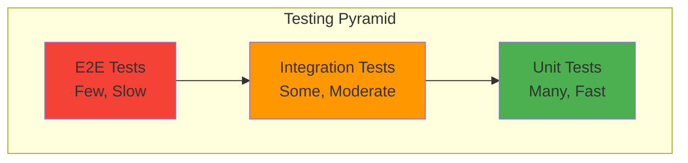

Learn how to test each layer of the hexagonal architecture effectively.

## Testing Pyramid

The project follows the testing pyramid with emphasis on unit tests:



<CardGroup cols={3}>
  <Card title="Unit Tests" icon="vial">
    **70%** - Test business logic in isolation with mocks
  </Card>
  <Card title="Integration Tests" icon="plug">
    **20%** - Test adapters with real infrastructure
  </Card>
  <Card title="E2E Tests" icon="globe">
    **10%** - Test complete flows through REST API
  </Card>
</CardGroup>

## Unit Testing (Core Module)

The core module is **pure Java** with no framework dependencies, making it extremely easy to test.

### Testing Services

```java ProductServiceTest.java
package com.fbaron.ims.product.service;

import com.fbaron.ims.product.exception.ProductNotFoundException;
import com.fbaron.ims.product.model.Product;
import com.fbaron.ims.product.repository.ProductCommandRepository;
import com.fbaron.ims.product.repository.ProductQueryRepository;
import org.junit.jupiter.api.Test;
import org.junit.jupiter.api.extension.ExtendWith;
import org.mockito.InjectMocks;
import org.mockito.Mock;
import org.mockito.junit.jupiter.MockitoExtension;

import java.util.Optional;
import java.util.UUID;

import static org.junit.jupiter.api.Assertions.assertEquals;
import static org.junit.jupiter.api.Assertions.assertThrows;
import static org.mockito.Mockito.verify;
import static org.mockito.Mockito.when;

@ExtendWith(MockitoExtension.class)
class ProductServiceTest {

    @Mock
    private ProductQueryRepository productQueryRepository;
    
    @Mock
    private ProductCommandRepository productCommandRepository;
    
    @InjectMocks
    private ProductService productService;

    @Test
    void registerDelegatesToCommandRepository() {
        Product product = Product.builder().name("Keyboard").build();
        Product savedProduct = Product.builder()
                .id(UUID.randomUUID())
                .name("Keyboard")
                .build();
        when(productCommandRepository.save(product)).thenReturn(savedProduct);

        Product result = productService.register(product);

        assertEquals(savedProduct, result);
        verify(productCommandRepository).save(product);
    }

    @Test
    void getByIdThrowsWhenProductIsMissing() {
        UUID productId = UUID.randomUUID();
        when(productQueryRepository.findById(productId)).thenReturn(Optional.empty());

        ProductNotFoundException exception = assertThrows(
                ProductNotFoundException.class,
                () -> productService.getById(productId)
        );

        assertEquals("Product not found with ID: " + productId, exception.getMessage());
    }
}
```

<Info>
  **No Spring context needed!** Tests run in milliseconds because they're pure Java.
</Info>

### Testing Business Logic

```java InventoryMovementServiceTest.java
@ExtendWith(MockitoExtension.class)
class InventoryMovementServiceTest {

    @Mock
    private ProductQueryRepository productQuery;
    
    @Mock
    private InventoryMovementCommandRepository movementCommand;
    
    @Mock
    private InventoryMovementQueryRepository movementQuery;
    
    @InjectMocks
    private InventoryMovementService service;

    @Test
    void inboundCreatesMovement() {
        UUID productId = UUID.randomUUID();
        Product product = Product.builder()
                .id(productId)
                .name("Widget")
                .build();
        when(productQuery.findById(productId)).thenReturn(Optional.of(product));
        
        InventoryMovement movement = InventoryMovement.builder()
                .product(product)
                .quantity(100)
                .type(MovementType.INBOUND)
                .reason("Initial stock")
                .build();
        when(movementCommand.save(any())).thenReturn(movement);

        InventoryMovement result = service.inbound(productId, 100, "Initial stock");

        assertNotNull(result);
        assertEquals(100, result.getQuantity());
        assertEquals(MovementType.INBOUND, result.getType());
        verify(movementCommand).save(any(InventoryMovement.class));
    }

    @Test
    void outboundThrowsWhenInsufficientStock() {
        UUID productId = UUID.randomUUID();
        Product product = Product.builder().id(productId).build();
        when(productQuery.findById(productId)).thenReturn(Optional.of(product));
        when(movementQuery.findTotalInputs(productId)).thenReturn(10);
        when(movementQuery.findTotalOutputs(productId)).thenReturn(0);

        InsufficientStockException exception = assertThrows(
                InsufficientStockException.class,
                () -> service.outbound(productId, 50, "Sale")
        );

        assertTrue(exception.getMessage().contains("Cannot exit 50 units"));
        verify(movementCommand, never()).save(any());
    }

    @Test
    void calculateStockReturnsCorrectBalance() {
        UUID productId = UUID.randomUUID();
        Product product = Product.builder().id(productId).build();
        when(productQuery.findById(productId)).thenReturn(Optional.of(product));
        when(movementQuery.findTotalInputs(productId)).thenReturn(150);
        when(movementQuery.findTotalOutputs(productId)).thenReturn(30);

        Integer stock = service.calculateStock(productId);

        assertEquals(120, stock);
    }
}
```

### Testing with Edge Cases

<AccordionGroup>
  <Accordion title="Null/Invalid Input">
    ```java
    @Test
    void inboundThrowsWhenQuantityIsNull() {
        UUID productId = UUID.randomUUID();
        
        assertThrows(
            InvalidMovementQuantityException.class,
            () -> service.inbound(productId, null, "Test")
        );
    }
    
    @Test
    void inboundThrowsWhenQuantityIsZero() {
        UUID productId = UUID.randomUUID();
        
        InvalidMovementQuantityException ex = assertThrows(
            InvalidMovementQuantityException.class,
            () -> service.inbound(productId, 0, "Test")
        );
        
        assertTrue(ex.getMessage().contains("must be greater than zero"));
    }
    ```
  </Accordion>
  
  <Accordion title="Not Found Scenarios">
    ```java
    @Test
    void inboundThrowsWhenProductNotFound() {
        UUID productId = UUID.randomUUID();
        when(productQuery.findById(productId)).thenReturn(Optional.empty());
        
        assertThrows(
            ProductNotFoundException.class,
            () -> service.inbound(productId, 10, "Test")
        );
    }
    ```
  </Accordion>
  
  <Accordion title="Boundary Conditions">
    ```java
    @Test
    void outboundAllowsExactStockAmount() {
        UUID productId = UUID.randomUUID();
        Product product = Product.builder().id(productId).build();
        when(productQuery.findById(productId)).thenReturn(Optional.of(product));
        when(movementQuery.findTotalInputs(productId)).thenReturn(50);
        when(movementQuery.findTotalOutputs(productId)).thenReturn(0);
        
        // Should not throw when removing exact stock amount
        assertDoesNotThrow(
            () -> service.outbound(productId, 50, "Sale")
        );
    }
    ```
  </Accordion>
</AccordionGroup>

## Integration Testing (Data Module)

Test adapters with real infrastructure using Testcontainers.

### JPA Adapter Integration Test

```java ProductJpaAdapterTest.java
@DataJpaTest
@AutoConfigureTestDatabase(replace = AutoConfigureTestDatabase.Replace.NONE)
@Testcontainers
class ProductJpaAdapterTest {

    @Container
    static PostgreSQLContainer<?> postgres = new PostgreSQLContainer<>("postgres:16")
            .withDatabaseName("testdb")
            .withUsername("test")
            .withPassword("test");

    @DynamicPropertySource
    static void configureProperties(DynamicPropertyRegistry registry) {
        registry.add("spring.datasource.url", postgres::getJdbcUrl);
        registry.add("spring.datasource.username", postgres::getUsername);
        registry.add("spring.datasource.password", postgres::getPassword);
    }

    @Autowired
    private ProductJpaRepository jpaRepository;

    @Autowired
    private ProductJpaMapper mapper;

    private ProductJpaAdapter adapter;

    @BeforeEach
    void setUp() {
        adapter = new ProductJpaAdapter(jpaRepository, mapper);
    }

    @Test
    void savePersistsProduct() {
        Product product = Product.builder()
                .id(UUID.randomUUID())
                .name("Laptop")
                .description("15-inch laptop")
                .price(new BigDecimal("999.99"))
                .category("Electronics")
                .build();

        Product saved = adapter.save(product);

        assertNotNull(saved);
        assertEquals(product.getId(), saved.getId());
        assertEquals(product.getName(), saved.getName());
    }

    @Test
    void findByIdReturnsProduct() {
        // Arrange: Save a product
        Product product = Product.builder()
                .id(UUID.randomUUID())
                .name("Mouse")
                .build();
        adapter.save(product);

        // Act: Find by ID
        Optional<Product> found = adapter.findById(product.getId());

        // Assert
        assertTrue(found.isPresent());
        assertEquals("Mouse", found.get().getName());
    }

    @Test
    void findAllReturnsAllProducts() {
        adapter.save(Product.builder().id(UUID.randomUUID()).name("Product 1").build());
        adapter.save(Product.builder().id(UUID.randomUUID()).name("Product 2").build());

        List<Product> products = adapter.findAll();

        assertTrue(products.size() >= 2);
    }
}
```

### MongoDB Adapter Integration Test

```java ProductMongoAdapterTest.java
@DataMongoTest
@Testcontainers
class ProductMongoAdapterTest {

    @Container
    static MongoDBContainer mongodb = new MongoDBContainer("mongo:7")
            .withExposedPorts(27017);

    @DynamicPropertySource
    static void setProperties(DynamicPropertyRegistry registry) {
        registry.add("spring.data.mongodb.uri", mongodb::getReplicaSetUrl);
    }

    @Autowired
    private ProductMongoRepository mongoRepository;

    @Autowired
    private ProductMongoMapper mapper;

    private ProductMongoAdapter adapter;

    @BeforeEach
    void setUp() {
        adapter = new ProductMongoAdapter(mongoRepository, mapper);
    }

    @Test
    void savePersistsToMongoDB() {
        Product product = Product.builder()
                .id(UUID.randomUUID())
                .name("Keyboard")
                .build();

        Product saved = adapter.save(product);

        assertNotNull(saved);
        Optional<Product> found = adapter.findById(saved.getId());
        assertTrue(found.isPresent());
    }
}
```

<Note>
  **Testcontainers** provides real database instances in Docker containers, ensuring tests are reliable and reproducible.
</Note>

## End-to-End Testing (Web Module)

Test complete flows through the REST API.

### REST API Test

```java ProductRestAdapterE2ETest.java
@SpringBootTest(webEnvironment = SpringBootTest.WebEnvironment.RANDOM_PORT)
@ActiveProfiles("test")
class ProductRestAdapterE2ETest {

    @Autowired
    private TestRestTemplate restTemplate;

    @Test
    void completeProductLifecycle() {
        // 1. Register a product
        RegisterProductDto registerDto = new RegisterProductDto(
                "Gaming Mouse",
                "RGB gaming mouse",
                new BigDecimal("59.99"),
                "Gaming"
        );

        ResponseEntity<ProductDto> createResponse = restTemplate.postForEntity(
                "/api/v1/products",
                registerDto,
                ProductDto.class
        );

        assertEquals(HttpStatus.CREATED, createResponse.getStatusCode());
        assertNotNull(createResponse.getBody());
        UUID productId = createResponse.getBody().id();

        // 2. Retrieve the product
        ResponseEntity<ProductDto> getResponse = restTemplate.getForEntity(
                "/api/v1/products/" + productId,
                ProductDto.class
        );

        assertEquals(HttpStatus.OK, getResponse.getStatusCode());
        assertEquals("Gaming Mouse", getResponse.getBody().name());

        // 3. List all products
        ResponseEntity<ProductDto[]> listResponse = restTemplate.getForEntity(
                "/api/v1/products",
                ProductDto[].class
        );

        assertEquals(HttpStatus.OK, listResponse.getStatusCode());
        assertTrue(listResponse.getBody().length > 0);
    }

    @Test
    void inventoryMovementFlow() {
        // 1. Create product
        RegisterProductDto productDto = new RegisterProductDto(
                "Widget", "Test widget", BigDecimal.TEN, "Test"
        );
        ProductDto product = restTemplate.postForEntity(
                "/api/v1/products",
                productDto,
                ProductDto.class
        ).getBody();

        // 2. Add stock
        RegisterInventoryMovementDto inboundDto = new RegisterInventoryMovementDto(
                product.id(), 100, "Initial stock"
        );
        ResponseEntity<InventoryMovementDto> inboundResponse = restTemplate.postForEntity(
                "/api/v1/inventories/inbound",
                inboundDto,
                InventoryMovementDto.class
        );
        assertEquals(HttpStatus.CREATED, inboundResponse.getStatusCode());

        // 3. Check stock
        ResponseEntity<Integer> stockResponse = restTemplate.getForEntity(
                "/api/v1/inventories/" + product.id(),
                Integer.class
        );
        assertEquals(100, stockResponse.getBody());

        // 4. Remove stock
        RegisterInventoryMovementDto outboundDto = new RegisterInventoryMovementDto(
                product.id(), 30, "Sale"
        );
        restTemplate.postForEntity(
                "/api/v1/inventories/outbound",
                outboundDto,
                InventoryMovementDto.class
        );

        // 5. Verify new stock
        stockResponse = restTemplate.getForEntity(
                "/api/v1/inventories/" + product.id(),
                Integer.class
        );
        assertEquals(70, stockResponse.getBody());
    }

    @Test
    void returnsNotFoundForMissingProduct() {
        UUID randomId = UUID.randomUUID();

        ResponseEntity<String> response = restTemplate.getForEntity(
                "/api/v1/products/" + randomId,
                String.class
        );

        assertEquals(HttpStatus.NOT_FOUND, response.getStatusCode());
    }
}
```

## Test Configuration

### Test Profile

```yaml application-test.yaml
spring:
  jpa:
    hibernate:
      ddl-auto: create-drop
    show-sql: true

  datasource:
    url: jdbc:h2:mem:testdb
    driver-class-name: org.h2.Driver

app:
  persistence:
    type: jpa
```

### Test Dependencies

```groovy build.gradle
dependencies {
    testImplementation 'org.springframework.boot:spring-boot-starter-test'
    testImplementation 'org.testcontainers:testcontainers:1.19.3'
    testImplementation 'org.testcontainers:postgresql:1.19.3'
    testImplementation 'org.testcontainers:mongodb:1.19.3'
    testImplementation 'org.testcontainers:junit-jupiter:1.19.3'
    testRuntimeOnly 'org.junit.platform:junit-platform-launcher'
}
```

## Testing Best Practices

<AccordionGroup>
  <Accordion title="Test Naming Convention">
    Use descriptive test names that explain the scenario:
    
    **Good:**
    ```java
    @Test
    void outboundThrowsInsufficientStockWhenStockIsTooLow() { }
    ```
    
    **Bad:**
    ```java
    @Test
    void test1() { }
    ```
  </Accordion>
  
  <Accordion title="Arrange-Act-Assert Pattern">
    Structure tests with clear sections:
    
    ```java
    @Test
    void example() {
        // Arrange
        Product product = Product.builder().name("Test").build();
        when(repo.save(product)).thenReturn(product);
        
        // Act
        Product result = service.register(product);
        
        // Assert
        assertEquals(product, result);
        verify(repo).save(product);
    }
    ```
  </Accordion>
  
  <Accordion title="Test Independence">
    Each test should be independent and not rely on execution order:
    
    ```java
    @BeforeEach
    void setUp() {
        // Reset state before each test
        repository.deleteAll();
    }
    ```
  </Accordion>
  
  <Accordion title="Use Test Fixtures">
    Create reusable test data builders:
    
    ```java
    class ProductFixtures {
        static Product.ProductBuilder defaultProduct() {
            return Product.builder()
                    .id(UUID.randomUUID())
                    .name("Default Product")
                    .price(BigDecimal.TEN);
        }
    }
    
    // Usage
    Product product = ProductFixtures.defaultProduct()
            .name("Custom Name")
            .build();
    ```
  </Accordion>
</AccordionGroup>

## Coverage Goals

<Tabs>
  <Tab title="Core Module">
    **Target: 90%+ coverage**
    
    - All service methods
    - All business logic paths
    - All exception cases
    - Edge cases and validations
  </Tab>
  
  <Tab title="Data Module">
    **Target: 70%+ coverage**
    
    - Adapter implementations
    - Custom query methods
    - Mapping logic
  </Tab>
  
  <Tab title="Web Module">
    **Target: 80%+ coverage**
    
    - Controller endpoints
    - DTO validation
    - Error handling
  </Tab>
</Tabs>

## Running Tests

<CodeGroup>
```bash All Tests
./gradlew test
```

```bash Specific Module
./gradlew :core:test
./gradlew :data:test
./gradlew :web:test
```

```bash With Coverage Report
./gradlew test jacocoTestReport

# View report at:
# build/reports/jacoco/test/html/index.html
```

```bash Continuous Testing
./gradlew test --continuous
```
</CodeGroup>

## Next Steps

<CardGroup cols={2}>
  <Card title="Adding Features" icon="plus" href="/guides/adding-features">
    Learn how to add new features with tests
  </Card>
  <Card title="Architecture Overview" icon="sitemap" href="/architecture/overview">
    Understand the testable design
  </Card>
  <Card title="Core Domain" icon="cube" href="/domain/products">
    See tested domain examples
  </Card>
  <Card title="Persistence Adapters" icon="database" href="/guides/persistence-adapters">
    Test different adapter types
  </Card>
</CardGroup>
