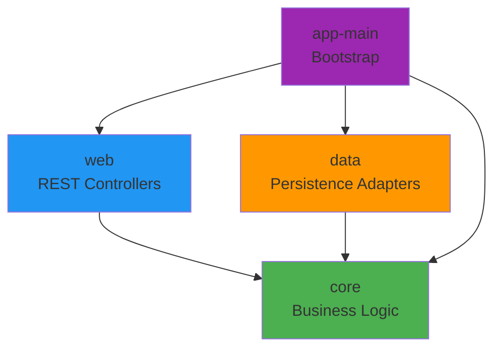

Welcome to the **Modular Hexagonal Inventory System** documentation. This project demonstrates how to build scalable, testable, and maintainable Java applications using hexagonal architecture principles with a strict modular design.

## What is This Project?

This is a production-grade inventory management system built with:

<CardGroup cols={2}>
  <Card title="Clean Architecture" icon="layer-group">
    Strict separation between business logic, adapters, and infrastructure
  </Card>
  <Card title="Multiple Adapters" icon="plug">
    JPA, JDBC, MongoDB, and Elasticsearch persistence options
  </Card>
  <Card title="Framework Agnostic" icon="cube">
    Core business logic has zero framework dependencies
  </Card>
  <Card title="Highly Testable" icon="vial">
    Pure Java domain with mockable ports and adapters
  </Card>
</CardGroup>

## Key Features

<AccordionGroup>
  <Accordion title="Product Management">
    Register and list products with comprehensive details including name, description, price, and category.
  </Accordion>
  
  <Accordion title="Inventory Movements">
    Track inbound (add stock) and outbound (remove stock) movements with reasons and timestamps.
  </Accordion>
  
  <Accordion title="Stock Balance">
    Calculate current stock levels per product based on movement history.
  </Accordion>
  
  <Accordion title="Modular Hexagonal Layout">
    Four strictly decoupled modules: core domain, data adapters, web adapters, and bootstrap application.
  </Accordion>
</AccordionGroup>

## Tech Stack

<Steps>
  <Step title="Java 21">
    Latest LTS version with modern language features
  </Step>
  <Step title="Spring Boot 3.5.10">
    Latest Spring Boot framework for dependency injection and infrastructure
  </Step>
  <Step title="Gradle Multi-Module">
    Strict module boundaries enforced at build time
  </Step>
  <Step title="Lombok & MapStruct">
    Reduced boilerplate with code generation
  </Step>
</Steps>

## Architecture Overview

The project follows a **strict modular hexagonal architecture** with four independent Gradle modules:

<Note>
  The **core** module contains pure Java business logic with no framework dependencies, making it highly portable and testable.
</Note>

## Who Should Use This?

This project is ideal for:

- **Architects** looking for a reference implementation of hexagonal architecture
- **Teams** wanting to build maintainable enterprise applications
- **Developers** learning clean architecture patterns in Java
- **Projects** requiring multiple persistence strategies

## What You'll Learn

Through this documentation, you'll discover:

- How to structure a multi-module Java application
- Implementing ports and adapters pattern
- Creating swappable persistence adapters
- CQRS-inspired repository separation
- Environment-driven configuration
- Testing strategies for hexagonal architecture

<Tip>
  Ready to get started? Head over to the [Quickstart](/quickstart) guide to run the application in minutes.
</Tip>
